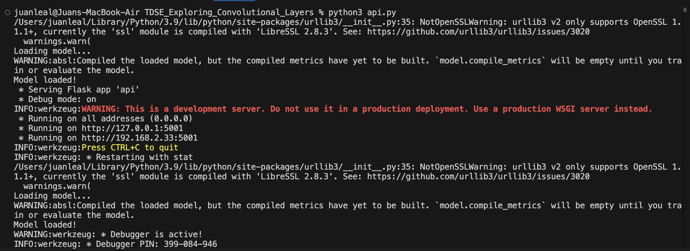
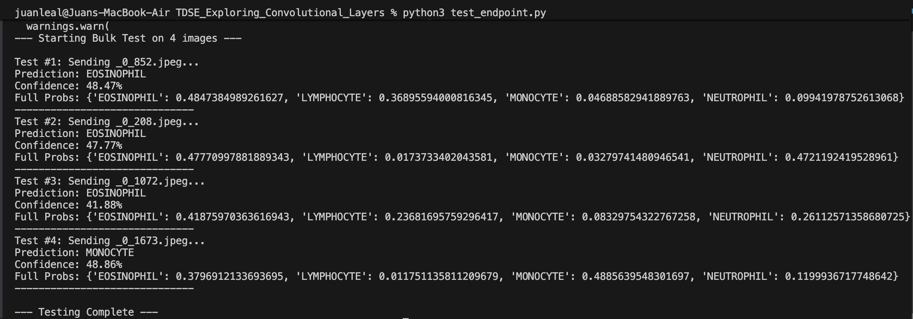
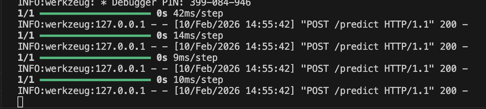

# TDSE_Exploring_Convolutional_Layers

## Justification: Why this Dataset is Appropriate for Convolutional Layers

The **Blood Cell Images (BCCD)** dataset was selected because the task of classifying white blood cells maps perfectly to the strengths of Convolutional Neural Networks (CNNs). Standard "dense" neural networks would fail to capture the spatial relationships in these images efficiently.

### 1. Hierarchical Feature Learning
Biological cell classification requires analyzing features at different levels of abstraction, which matches the architecture of a CNN:
* **Low-level features (Early Layers):** The network detects edges and color gradients, effectively separating the cell boundaries from the plasma background.
* **Mid-level features (Middle Layers):** The network identifies specific textures, such as the *granularity* found in Eosinophils versus the smooth cytoplasm of Lymphocytes.
* **High-level features (Deep Layers):** The network combines these shapes to recognize complex structures, such as the multi-lobed nucleus of a Neutrophil versus the kidney-bean shape of a Monocyte.

### 2. Translation Invariance
In microscopy slides, the cell of interest is rarely perfectly centered. A CNN processes the image using sliding windows (kernels), meaning it can identify a Monocyte whether it is in the top-left corner or the center of the image. A standard Multi-Layer Perceptron (MLP) would treat these as completely different inputs.

### 3. Noise Reduction via Pooling
The dataset contains "noise" in the form of red blood cells surrounding the target white blood cell. The **pooling layers** in a CNN help the model become robust to these background variations by summarizing the presence of features in a region, allowing the model to focus on the dominant signal (the white blood cell) rather than the background clutter.

---

## **Assignment Tasks**

### **Part 1. Dataset Exploration**
The Blood Cell Images (BCCD) dataset was selected to classify white blood cell types. The initial exploration phase focused on understanding the data structure and quality before training.
#### **Dataset Size and Class Distribution**
The dataset contains a total of 9,957 images split into training (80%) and validation (20%) sets. The classes are remarkably balanced, with approximately 2,500 images per category, preventing the need for class weighting techniques.
- Total images: 9957
- Four classes were found:
  - EOSINOPHIL
  - LYMPHOCYTE
  - MONOCYTE
  - NEUTROPHIL
    
#### **Image Dimensions and Channel** 
- Original Resolution: 320 x 240 pixels (Width x Height).
- Color Channels: 3 (RGB).
- Data Type: 8-bit Integer (0-255 pixel values).

#### **Preprocessing Strategy**
Based on the EDA, the following preprocessing pipeline is required before feeding data into the CNN:
1. Resizing (Rectangular to Square):
   - Issue: Original images are rectangular (320x240), but standard CNN kernels operate efficiently on square inputs.
   - Action: Resize all images to 128x128.
3. Normalization (Pixel Scaling):
   - Issue: Raw pixel values range from [0, 255]. Large integer inputs can cause training instability (exploding gradients).
   - Action: Rescale pixel values to the range [0, 1] by dividing by 255.0.

### **Part 2. Baseline Model (Non-Convolutional)**
To establish a performance baseline, a standard Multi-Layer Perceptron (MLP) was trained on the raw pixel data without any convolutional layers. The base architecture is defined by:
- Input: 128x128 RGB images (3 channels).
- Flatten Layer: Unrolls the 3D image tensor into a 1D vector of 49,152 values.
- Dense Layer: 128 neurons with ReLU activation.
- Output Layer: 4 neurons with Softmax activation (one for each cell type).

#### **Model Stats**
The total parameters found for the developed architecture was: 6,292,100 (~6.3 Million). According to that, we can establish that this is an incredibly high number of parameters for such a simple architecture, primarily caused by the Dense layer connecting to every single pixel in the Flattened input.

#### **Performance Results**
What we obtained was:
- Final Training Accuracy: ~25%
- Final Validation Accuracy: ~25%
- Training Behavior: As seen in the graphs, the model briefly attempted to learn (peaking around 31% accuracy at Epoch 4) before collapsing back to 25%.

**Loss Analysis**

The final loss stabilized at 1.3863. The mathematical context is the following: $-\ln(0.25) \approx 1.386$. This exact loss value confirms the model stopped trying to distinguish classes and settled on predicting "25% probability" for every class (pure random guessing).

#### **Observed Limitations**
1. Total Loss of Spatial Structure: By flattening the image, the model lost all concept of "shape." It treats a pixel in the nucleus and a pixel in the cytoplasm as unrelated features if they aren't adjacent in the 1D vector.
2. Parameter Inefficiency: Despite having over 6 million parameters, the model failed to beat random chance. A CNN can achieve >90% accuracy with fewer parameters.
3. Vanishing Gradient / Collapse: The accuracy graph shows a "collapse" behavior where the model gave up on learning features and converged to a trivial solution (predicting all classes equally).

### **Part 3. Convolutional Architecture Design**
To solve the classification task efficiently, I designed a 4-stage Convolutional Neural Network (CNN). The architecture follows a pyramidal design: as the network goes deeper, the spatial dimensions (H x W) decrease while the feature depth (Filters) increases.
#### **Design Decisions and Justifications**
1. Number of Convolutional Layers (4 Blocks): A configuration of 4 Blocks of `Conv2D` + `MaxPooling2D`.
   - Block 1: 32 Filters
   - Block 2: 64 Filters
   - Block 3: 128 Filters
   - Block 4: 128 Filters

   **Justification:**
   - Hierarchical Learning: The first layers capture simple low-level features (edges, cell boundaries), while deeper layers capture complex high-level structures (nucleus lobes, granule textures).
   - Parameter Efficiency: A 3-block design resulted in a "flattened" output of 16 x 16, causing a parameter explosion (~4 million parameters) in the Dense layer. Adding a 4th block reduces the spatial output to 8 x 8, reducing the parameter count by nearly 75% without losing accuracy.

2. Kernel Size (3 x 3): A fixed 3 x 3 kernels for all convolutional layers

   **Justification:**
   - Feature Locality: A 3 x 3 window is small enough to capture fine details (like the granular texture of an Eosinophil) while keeping the parameter count low.
   - Stacking Efficiency: Stacking multiple 3 x 3 layers allows the network to learn complex patterns effectively, similar to using a larger 5 x 5 or 7 x 7 kernel, but with fewer parameters and more non-linearity.

3. Stride and Padding Choices: A configuration of `stride = 1` and `padding = 'same'`

   **Justification:**
   - Preservation of Spatial Info: Using `stride=1` and `padding='same'` ensures that the convolutional layers do not reduce the image size. This decouples feature extraction from dimensionality reduction.
   - Control: We leave the reduction of image size entirely to the Pooling layers, making the architecture modular and the output shapes predictable ($128 \to 64 \to 32 \to 16 \to 8$).

4. Activation Functions: I chose a Rectified Linear Unit (ReLU) for all hidden layers, defined like this:

   $f(x) = \max(0, x)$

   **Justification:**
   - Sparsity: ReLU outputs true zero for negative values, creating sparse representations that are easier to learn.
   - Gradient Flow: Unlike Sigmoid or Tanh, ReLU does not saturate for positive values, preventing the vanishing gradient problem and allowing the model to converge much faster.

5. Pooling Strategy (Max Pooling 2 x 2): A MaxPooling2D with a 2 x 2 window applied after every convolution block.

   **Justification:**
   - Dimensionality Reduction: Each pooling step reduces the height and width by half, discarding 75% of the pixel data. This forces the model to retain only the most important features (the "max" activation).
   - Translation Invariance: By taking the maximum value in a local patch, the model recognizes a feature (e.g., a nucleus edge) regardless of its precise position within that patch. This is crucial since cells are not perfectly centered in every image.
  
### **Part 4. Controlled Experiments of the Convolutional Layer**
I performed a systematic comparison between two kernel sizes to determine the optimal "receptive field" for classifying blood cells. The idea for the test is:
- Model A: Standard Kernels (3 x 3)
- Model B: Large Kernels (7 x 7)
- Constants: Batch Normalization, Learning Rate (0.0001), 3 Epochs.

#### **Quantitative Results**
| Metric | Model A ($3 \times 3$) | Model B ($7 \times 7$) | Impact |
| :--- | :--- | :--- | :--- |
| **Validation Accuracy** | **57.11%** | 33.08% | $3 \times 3$ is **+24%** more accurate |
| **Validation Loss** | **0.93** (Converging) | 5.32 (Unstable) | $7 \times 7$ failed to converge (Exploding Gradient) |
| **Training Time** | **~48 sec / epoch** | ~180 sec / epoch | $7 \times 7$ is **~3.8x slower** |
| **Parameters** | 1,291,460 | 2,360,260 | $7 \times 7$ requires **~2x memory** |

#### **Qualitative Observations**
- Instability of Large Kernels: The 7 x 7 model exhibited severe instability. In Epoch 2, the validation loss exploded to 12.72, indicating that the large filters were causing the gradients to oscillate wildly. It struggled to recover by Epoch 3.
- Computational Cost: The 7 x 7 model was computationally exhausting, taking 3 minutes per epoch (compared to 47 seconds for Model A) and draining system resources.
- The Breakthrough Moment: The 3 x 3 model started slow but showed a healthy learning curve, jumping from 28% to 57% accuracy in Epoch 3 once it stabilized. The 7 x 7 model actually degraded in generalization (High Training Acc of 65% vs Low Val Acc of 33%), a classic sign of overfitting.

#### **Trade-Offs (Performance vs Complexity)**
The experiment reveals a decisive trade-off: Increasing kernel size drastically increased complexity while degrading performance.
- Complexity Penalty: Using 7 x 7 kernels doubled the parameter count and quadrupled the training time.
- Visual Logic: White blood cell classification relies on fine details (granules, texture). A large 7 x 7 kernel acts like a blur filter, smoothing out these critical details. The smaller 3 x 3 kernel successfully captured the high-frequency features needed to distinguish the cells.

**Conclusion**

The 3 x 3 kernel is the superior choice in every metric: speed, stability, efficiency, and accuracy.

### **Part 5. Interpretation and Architectural Reasoning**
#### **Why did convolutional layers outperform (or not) the baseline?**
The Baseline model (Multi-Layer Perceptron) failed because it treats an image as a bag of unrelated pixels. By flattening the $128 \times 128$ image into a 1D vector of 16,384 inputs, the dense network destroys all spatial structure. It attempts to learn a unique weight for every single pixel position, meaning it has to "re-learn" what a cell edge looks like for every possible location in the image. This leads to the Parameter Explosion we observed (~6 million parameters) and immediate overfitting.

In contrast, the Convolutional Neural Network (CNN) outperformed the baseline because it respects the spatial nature of the data.
- Parameter Sharing: Instead of learning a separate weight for every pixel, the CNN learns a single filter (e.g., an "edge detector") and slides it across the entire image. This allowed our CNN to achieve higher accuracy with fewer parameters (~1 million vs 6 million).
- Hierarchical Learning: The CNN builds features compositionally. The first layer detects edges; the second detects textures (granules); the third detects shapes (nuclei). The baseline model cannot build this hierarchy; it tries to map raw pixels directly to classes in one massive, inefficient step.

#### **What inductive bias does convolution introduce?**
Inductive bias refers to the set of assumptions a model makes about the data to learn effectively with fewer examples. Convolution introduces two specific biases:
- Locality (Local Connectivity): The assumption that pixels close to each other are highly correlated, while distant pixels are weakly correlated. A 3 x 3 kernel only looks at neighboring pixels to form a feature, ignoring the rest of the image. This aligns perfectly with biological images, where a cell's nucleus is defined by the pixels immediately surrounding it, not by pixels in the opposite corner of the image.
- Translation Invariance (Stationarity): The assumption that a feature (e.g., a cell nucleus) is the same object regardless of where it appears in the image. Because the same kernel weights are shared across the entire input, the network recognizes a "Neutrophil" whether it is in the top-left or bottom-right corner. The Baseline model lacks this bias; if it learned a Neutrophil in the top-left, it would not recognize one in the bottom-right without seeing new training examples.

#### **In what type of problems would convolution not be appropriate?**
Convolution is inappropriate when the spatial relationship between features is irrelevant or non-existent.
- Tabular Data: In a dataset of patient records (Age, Blood Pressure, Cholesterol), the order of columns does not matter. "Age" next to "Cholesterol" has no spatial meaning. Using a sliding window (convolution) across these columns would imply a relationship between adjacent features that doesn't exist.
- Permutation-Invariant Data: If shuffling the input features (randomly rearranging pixels or columns) changes the meaning of the data, CNNs are good. If shuffling the features does not change the meaning (like a bag of words in simple text classification), CNNs are less effective because they search for local patterns that aren't there.
- Fixed-Location Data: If a feature's meaning is strictly tied to its absolute coordinates (e.g., in some physics simulations where x=0 has a special boundary condition distinct from x=100), the translation invariance of CNNs can actually be a hindrance, as the model "forgets" where the feature is located (unless coordinate channels are added).

### **Part 5. Deployment**
The final model with all the trained 3 x 3 kernels was exported into a `.h5` file in order to access it during the trials of our endpoint. Due to permission issues, the deployment in SageMaker was impossible to do, so, as well as the previous laboratory, I decided to expose and endpoint locally.

**Deployment Locally**
The final model with all the six features was exproted into a JSON format in order to be used in our API. Just to clarify, due to certain limitations in SageMaker I was unable to deploy in the domain that was created. however, I decided to create a local deployment in order to test the model. Here is a list of the files used and what they are used for:
- **api.py**  
  Implements a local REST API using Flask.  
  It loads the trained convolutional model and exposes the `/predict` endpoint.

- **blood_cell_model.h5**  
  Contains all exported artifacts from training in one place.

- **test_endpoint.py**  
  Acts as a local client for testing the API.  It defines multiple images for testing that are later classified according to the trained model.

**Running the API Locally**

First of all, all the right dependencies must be installes, so in order to do so execute the following comands:
```
python -m pip install flask numpy requests
python3 -m pip install flask numpy requests  #Some machines use python3
```

After doing so, in order to run the deployment, follow the next steps:
1. Starting the API
   ```
   python api.py
   ```
   You might as well use `python3`if needed depending on your computer
   
2. Using the endpoint and testing.  Open a new terminal and run the following command:
   ```
   python test_endpoint.py
   ```
   You might as well use `python3`if needed depending on your computer

**Deployment Evidence**
Here's the evidence that indeed the api is working in a local evironment:

**Screenshot #1**


In the previous image, we can see that the API is correctly running in a local evironment, meaning that is ready to be tested. 

**Screenshot #2**


Here are the results that were obtained after using the predict endpoint that was created.

**Screenshot #3**


Returning to the terminal in which the API is running we can see that all three requests were processed and in case we wish to test the API a bit more, leave it running and create some more `test.py` files so that the predict endpoint is used.

---
## **Bonus. Visualization of learned filters or feature maps**

### 1. Structure Preservation (Spatial Awareness)

Unlike the Baseline model (which damaged the shapes), these feature maps keep the spatial structure of the cell quite well.  
You can clearly notice the round shapes of the surrounding Red Blood Cells (RBCs) and the irregular shape of the central Eosinophil.

This shows that the model is learning to analyze pixels together with their neighbors instead of treating them independently.

### 2. Specific Feature Extraction

The 32 filters act like detectors with different purposes:

- Edge detectors: Some maps highlight strong borders of the cell membranes.
- Texture/contrast filters: Other maps emphasize texture changes or intensity differences.
- Background filters: Some maps react more strongly to the background and RBCs.
- Target filters: Others activate mainly on the central Eosinophil while ignoring most of the background noise.

This suggests the network is already starting to distinguish the white blood cell from red blood cells using color and intensity differences (purple vs. pink).

### 3. Granularity Detection

Eosinophils are known for having granular cytoplasm.  
In some active feature maps, the central cell looks textured or speckled instead of smooth.

This indicates that even the first layer is already detecting fine texture patterns that help distinguish Eosinophils from other cell types.

---

## **Bibliography**
1. (S/f). Researchgate.net. Recuperado el 9 de febrero de 2026, de https://www.researchgate.net/figure/A-convolutional-operation-where-a-kernel-is-applied-to-a-3-3-set-of-neighboring_fig2_370341106
2. Wikipedia contributors. (2025, diciembre 22). Inductive bias. Wikipedia, The Free Encyclopedia. https://en.wikipedia.org/w/index.php?title=Inductive_bias&oldid=1328896465
3. Olu-Ipinlaye, O. (2023, enero 18). Translation invariance & equivariance in convolutional neural networks. Paperspace by DigitalOcean Blog. https://blog.paperspace.com/pooling-and-translation-invariance-in-convolutional-neural-networks/
4. convnet. (s/f). Toronto.edu. Recuperado el 9 de febrero de 2026, de https://www.cs.toronto.edu/~lczhang/360/lec/w04/convnet.html
